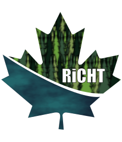

<!-- README.md is generated from README.Rmd. Please edit that file -->
<!--
You'll still need to render `README.Rmd` regularly, to keep `README.md` up-to-date. `devtools::build_readme()` is handy for this. 
-->
<!--RiCHT Logo-->



<!--RiCHT Title-->

# **RiCHT**

<!-- badges: start -->
<!--release, build pass-->

[](https://lifecycle.r-lib.org/articles/stages.html#experimental)
[](https://CRAN.R-project.org/package=RiCHT)
[](https://opensource.org/licenses/MIT)

<!-- badges: end -->

The goal of the Riparian Critical Habitat Tool (RiCHT) is to provide
quantitative evidence to support the delineation of riparian Critical
Habitat. The tool provides an interface for a searchable database
containing the current state of knowledge regarding the relationships
between the riparian zone (attributes and processes), aquatic features,
and aquatic species at risk.

## Disclaimer

This App is a work in progress. It is being used to test UI, UX, and
Deployment. In its current form, it has limited functionality. Some
features have limited or no implementation.

## Installation

You can install the development version of RiCHT from
[GitHub](https://github.com/) with:

``` r
# install.packages("devtools")
devtools::install_github("dfrancis01/dfo-richt-project")
RiCHT::run_app()
```

## Repo Structure

``` bash
.
│   .gitignore
│   .Rbuildignore
│   .Rhistory
│   .Rprofile
│   DESCRIPTION
│   LICENSE
│   LICENSE.md
│   NAMESPACE
│   README.md
│   README.Rmd
│   renv.lock
│   RiCHT.Rproj
├───inst
│   └───www
│       ├───css
│       │       *.css
│       │       RiCHT.css
│       ├───img
│       └───js
│               *.js
├───man
│   │   *.Rd
│   │
│   └───figures
│           logo.png
├───R
│       mod_*.R
│       run_app.R
│       server.R
│       ui.R
│       utils-pipe.R
│       zzz.R
└───renv
       .gitignore
       activate.R
       settings.dcf
```

## Projects Referenced

[Can-GLWS](https://www.uoguelph.ca/watershed/glws/) / [A Dashboard for
Conference
Tweets](https://shiny.rstudio.com/gallery/conference-tweet-dashboard.html)
/ [Spatial Reproducible
Reporting](https://github.com/dfo-mar-odis/shinySpatialApp) / [Commute
Explorer](https://nz-stefan.shinyapps.io/commute-explorer-2/)
